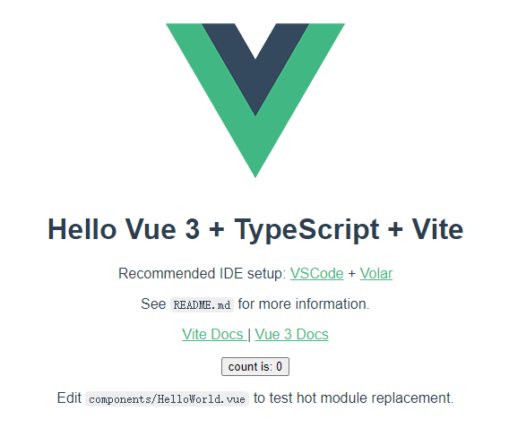
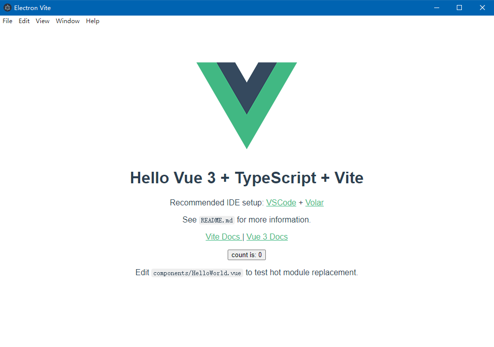
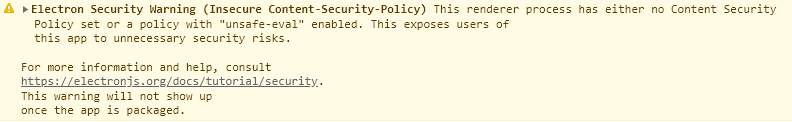
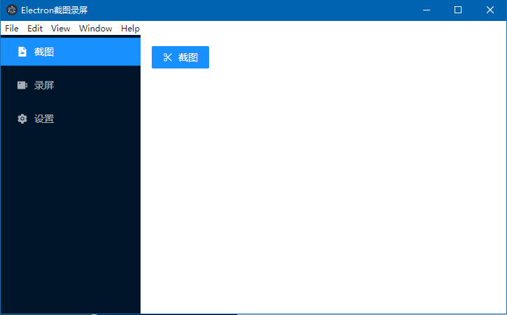
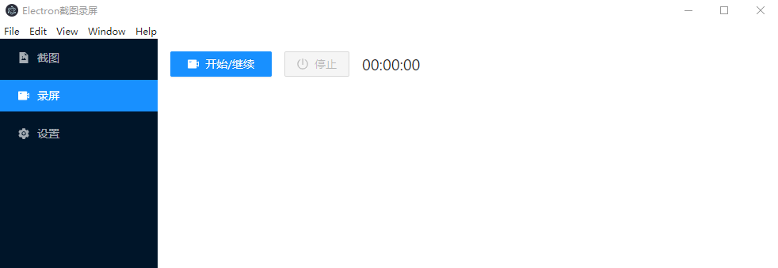
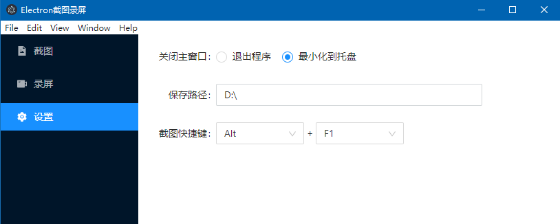

# Electron+Vue3+Vite+AntDesignVue 实现截图和录屏桌面应用

假定读者有一定的 Vue3 基础，本项目采用 Ant Design Vue 的 Vue3 版本，可以根据个人喜好和使用习惯自行选择组件库。


## 1. 创建 Vite 项目

首先，创建 Vite 项目：

```sh
npm create vite electron-vite
```

选择生成 vue-ts 的项目，不使用 TypeScript 则选择 vue 模板。

然后，进入项目目录，安装相关的依赖：

```sh
npm install
```

然后运行项目：

```sh
npm run dev
```

编译成功后，可以在 `http://localhost:3000` 打开页面。



如果使用 TS + setup 语法糖，需要安装 `unplugin-auto-import`：

```sh
npm install --save-dev unplugin-auto-import
```

```diff
  // vite.config.js
  import { defineConfig } from 'vite'
  import vue from '@vitejs/plugin-vue'
+ import AutoImport from 'unplugin-auto-import/vite'

  // https://vitejs.dev/config/
  export default defineConfig({
    plugins: [
      vue(),
+     // 自动导入Vue3组合式API（使用setup语法糖）
+     AutoImport({
+       imports: ['vue'],
+       dts: 'src/auto-imports.d.ts'
+     })
    ]
  })
```


## 2. 引入 Electron

### 安装

首先，安装 Electron：

```sh
npm install electron --save-dev
```


### 修改 package.json

然后，修改 `package.json`：

```diff
  {
+   "main": "electron/main.js",
    "scripts": {
      "dev": "vite",
      "build": "vue-tsc --noEmit && vite build",
      "preview": "vite preview",
+     "electron:dev": "electron ."
    }
  }
```

- `main` 指定入口文件，为了方便管理，我们把包括 `main.js` 在内的 Electron 相关的业务代码放在 `electron/` 目录下。
- `electron:dev` 为新增的运行命令，用于在开发环境启动项目。


### 主进程文件 main.js

然后创建控制主进程的文件 `electron/main.js`：

```js
const { app, BrowserWindow } = require('electron')

function createWindow() {
  const mainWindow = new BrowserWindow({
    width: 1000,
    height: 700
  })

  mainWindow.loadURL('http://localhost:3000')
}

app.whenReady().then(() => {
  createWindow()
})

app.on('window-all-closed', () => {
  if (process.platform !== 'datwin') {
    app.quit()
  }
})

app.on('activate', () => {
  createWindow()
})
```

- `app` 模块：控制着整个程序的声明周期，创建新窗口，关闭程序等都由 `app` 控制。
- `BrowserWindow` 模块：创建和管理应用程序的窗口，`BrowserWindow` 创建一个新的窗口，对应一个页面和一个渲染进程，一个应用可以有多个窗口，也就是可以有多个渲染进程。

上面的代码，在应用程序启动之后，新建一个窗口，窗口加载 `http://localhost:3000` 页面。


### 运行桌面应用

运行 `npm run electron:dev` ，启动项目，注意要先运行 `npm run dev` 启动 Vite 项目。




### 安全警告

点击左上角菜单 View -> Toogle Developer Tools，或者按快捷键 `Ctrl+Shift+I` ，打开调试工具，会看到一个安全警告：



在 `index.html` 添加  CSP（Content-Security-Policy，内容安全策略） `<meta>` 标签：

```diff
  <!DOCTYPE html>
  <html lang="en">
    <head>
      <meta charset="UTF-8" />
      <link rel="icon" href="/favicon.ico" />
      <meta name="viewport" content="width=device-width, initial-scale=1.0" />
+     <meta http-equiv="Content-Security-Policy" content="script-src 'self' 'unsafe-inline';" />
      <title>Electron截图录屏</title>
    </head>
    <body>
      <div id="app"></div>
      <script type="module" src="/src/main.ts"></script>
    </body>
  </html>
```

重启项目，控制台不再打印安全警告。


### 自动更新和单个启动命令

Vite 的页面可以热更新，但是如果修改 Electron 的代码，每次都要手动重启桌面应用，这就比较麻烦；除此之外，我们还希望只需要运行一个命令，就能启动完整的项目，提高开发效率。为此，我们引入 `nodemon` 和 `concurrently` 两个插件：

```sh
npm install -save-dev nodemon concurrently 
```

修改 `package.json`：

```diff
  {
    "main": "electron/main.js",
    "scripts": {
      "dev": "vite",
      "build": "vue-tsc --noEmit && vite build",
      "preview": "vite preview",
-     "electron:dev": "electron ."
+     "electron:dev": "nodemon --watch electron --exec electron .",
+     "start": "concurrently \"npm run dev\" \"npm run electron:dev\""
    }
  }
```

- `nodemon` 监听 `electron/` 目录下的文件，如果文件修改，则自动重启桌面应用。
- `concurrently` 可以执行多条命令。

运行 `npm run start`，项目成功启动，修改 `electron/main.js` 中的代码，应用自动重启。


## 3. 引入 Ant Design Vue（可选）

本项目使用 ant-design-vue 3.x 版本作为 UI 组件库，首先引入组件库：

```sh
npm install ant-design-vue@next
```

项目中使用图标组件，需要另外引入 `@ant-design/icons-vue`：

```sh
npm install @ant-design/icons-vue
```

参考组件库文档，实现组件按需导入，首先安装 `unplugin-vue-components` 和 `unplugin-vue-components`：

```sh
npm install --save-dev unplugin-vue-components unplugin-vue-components
```

修改 `vite.config.js`：

```diff
  import { defineConfig } from 'vite'
  import vue from '@vitejs/plugin-vue'
  import AutoImport from 'unplugin-auto-import/vite'
+ import Components from 'unplugin-vue-components/vite'
+ import { AntDesignVueResolver } from 'unplugin-vue-components/resolvers'

  // https://vitejs.dev/config/
  export default defineConfig({
    plugins: [
      vue(),
      // 自动导入Vue3组合式API（使用setup语法糖）
      AutoImport({
        imports: ['vue'],
        dts: 'src/auto-imports.d.ts',
      }),
+    // 自动导入组件库
+     Components({
+       resolvers: [
+         AntDesignVueResolver()
+       ]
+     })
    ]
  })
```


## 4. 基本布局和路由



页面布局分为左右两部分，左边为侧边栏，右边为页面主体内容。左边是公共部分，右边通过嵌套路由渲染不同的内容。


### 基本布局

创建以下组件：

- 布局组件：`src/components/LayoutMain.vue` ；
- 侧边栏组件：`src/components/Sidebar.vue` ；
- 三个页面组件（空）： `src/views/Screenshot.vue` 、`src/views/Record.vue` 和 `src/views/Setting.vue` 。

```vue
<!-- src/components/LayoutMain.vue -->
<template>
  <div class="layout-main">
    <sidebar class="sidebar"></sidebar>
    <main class="main">
      <router-view></router-view>
    </main>
  </div>
</template>

<script setup lang="ts">
import Sidebar from './Sidebar.vue'
</script>

<style scoped>
.layout-main {
  display: flex;
}
.sidebar {
  width: 200px;
  height: 100vh;
  overflow: auto;
}
.main {
  flex: 1;
  padding: 16px;
}
</style>
```

```vue
<!-- src/components/Sidebar.vue -->
<template>
  <a-menu
    v-model:selectedKeys="selectedKeys"
    class="menu"
    mode="inline"
    theme="dark">
    <a-menu-item key="/screenshot">
      <template #icon><file-image-filled /></template>
      <span>截图</span>
    </a-menu-item>
    <a-menu-item key="/record">
      <template #icon><video-camera-filled /></template>
      <span>录屏</span>
    </a-menu-item>
    <a-menu-item key="/setting">
      <template #icon><setting-filled /></template>
      <span>设置</span>
    </a-menu-item>
  </a-menu>
</template>

<script setup lang="ts">
import {
  FileImageFilled,
  VideoCameraFilled,
  SettingFilled
} from '@ant-design/icons-vue'

const selectedKeys = reactive<string[]>(['/screenshot'])
</script>
```


### Vue Router

首先，安装 Vue Router：

```sh
npm install vue-router
```

定义路由表：

```typescript
// src/router/index.ts
import { createRouter, createWebHistory, RouteRecordRaw } from 'vue-router'
import LayoutMain from '../components/LayoutMain.vue'

export const routes: RouteRecordRaw[] = [
  {
    path: '/',
    component: LayoutMain,
    redirect: '/screenshot',
    children: [
      {
        path: '/screenshot',
        component: () => import('../views/Screenshot.vue')
      },
      {
        path: '/record',
        component: () => import('../views/Record.vue')
      },
      {
        path: '/setting',
        component: () => import('../views/Setting.vue')
      }
    ]
  }
]

const router = createRouter({
  history: createWebHistory(''),
  routes
})

export default router
```

挂载路由表：

```diff
  // src/main.ts
  import { createApp } from 'vue'
  import App from './App.vue'
  import router from './router'

- createApp(App).mount('#app')
+ const app = createApp(App)

+ app.use(router).mount('#app')
```

根组件引入路由：

```vue
<!-- src/App.vue -->
<template>
  <router-view></router-view>
</template>
```

为了缓存页面组件，引入 `<keep-alive>` ：

```diff
  <!-- src/components/LayoutMain.vue -->
  <template>
    <div class="layout-main">
      <sidebar class="sidebar"></sidebar>
      <main class="main">
-       <router-view></router-view>
+       <router-view #default="{ Component }">
+         <keep-alive>
+           <component :is="Component"></component>
+         </keep-alive>
+       </router-view>
      </main>
    </div>
  </template>
```


### 侧边栏交互

点击侧边栏，需要跳转对应的页面，并高亮对应的菜单：

```diff
  <template>
    <a-menu
      v-model:selectedKeys="selectedKeys"
      class="menu"
      mode="inline"
      theme="dark"
+     @select="onSelectItem">
      <a-menu-item key="/screenshot">
        <template #icon><file-image-filled /></template>
        <span>截图</span>
      </a-menu-item>
      <a-menu-item key="/record">
        <template #icon><video-camera-filled /></template>
        <span>录屏</span>
      </a-menu-item>
      <a-menu-item key="/setting">
        <template #icon><setting-filled /></template>
        <span>设置</span>
      </a-menu-item>
    </a-menu>
  </template>

  <script setup lang="ts">
  import {
    FileImageFilled,
    VideoCameraFilled,
    SettingFilled
  } from '@ant-design/icons-vue'
+ import { useRouter } from 'vue-router'

  const selectedKeys = reactive<string[]>(['/screenshot'])
+ const router = useRouter()

+ const onSelectItem = ({ key }: { key: string }) => {
+   selectedKeys.splice(0, 1, key)
+   router.push(key)
+ }
  </script>
```


## 5. 截图模块

### IPC 通信

处于安全考虑，渲染进程和主进程之间不能直接通信，需要通过 `ipcMain/ipcRenderer` 进行跨进程通信。

首先，定义 `electron/preload.js` 文件，用于向渲染器进程暴露 IPC 通道：

```js
const { contextBridge, ipcRenderer } = require('electron')

contextBridge.exposeInMainWorld('desktopCapturer', {
  screenshot: () => ipcRenderer.invoke('rendererInvoke:screenshot') // 截图
})
```

`contextBridge.exposeInMainWorld` 方法向 `window` 对象暴露一个 `desktopCapturer` 对象，对象包含一个 `screenshot` 方法。`ipcRenderer.invoke` 暴露了一个 IPC 通道给渲染进程，通过这个通道，可以向主进程传递数据。 `ipcRenderer.invoke` 方法从第二个参数开始，接收传递给主进程的数据。

修改 `electron/main.js` ，预加载脚本：

```diff
  const { app, BrowserWindow } = require('electron')
+ const path = require('path')

  function createWindow() {
    const mainWindow = new BrowserWindow({
      width: 1000,
      height: 700,
+     webPreferences: {
+       preload: path.resolve(__dirname, 'preload.js')
+     }
    })

    mainWindow.loadURL('http://localhost:3000')
  }

  app.whenReady().then(() => {
    createWindow()
  })
```

然后，在主进程中定义通道处理器，为了代码管理，我们定义 `electron/utils/ipcHandler` ，专门用于主进程响应渲染进程的事件：

```js
const { ipcMain, screen } = require('electron')

module.exports = {
  ipcHandler: () => {
    ipcMain.handle('rendererInvoke:screenshot', handleScreenshot)
  }
}

// 截图
function handleScreenshot() {
  return screen.getPrimaryDisplay()
}
```

`ipcMain.handle` 定义响应渲染进程的处理器，当渲染进程调用 `ipcRenderer.invoke('rendererInvoke:screenshot')` 时，主进程就会调用对应的回调函数，回调函数第一个参数 `event` 表示事件对象，从第二参数开始，接收从渲染进程传递的数据。我们在回调函数中获取并打印主窗口的信息。

然后在主进程中引入 `ipcHandler`：

```diff
  const { app, BrowserWindow } = require('electron')
  const path = require('path')
+ const { ipcHandler } = require('./utils/ipcHandler')

  function createWindow() {
    const mainWindow = new BrowserWindow({
      width: 1000,
      height: 700,
      webPreferences: {
        preload: path.resolve(__dirname, 'preload.js')
      }
    })

    mainWindow.loadURL('http://localhost:3000')

+   // 主进程响应事件
+   ipcHandler()
  }

  app.whenReady().then(() => {
    createWindow()
  })
```

最后，我们在页面中创建按钮并触发渲染器通道：

```vue
<template>
  <div>
    <a-button type="primary" @click="onScreenshot">
      <template #icon>
        <scissor-outlined></scissor-outlined>
      </template>
      截图
    </a-button>
  </div>
</template>

<script setup lang="ts">
import { ScissorOutlined } from '@ant-design/icons-vue'

const onScreenshot = async () => {
  // @ts-ignore
  const display = await window.desktopCapturer.screenshot()
  console.log(display)
}
</script>

<style scoped>
.form {
  margin-top: 16px;
}
.select {
  width: 64px;
}
</style>
```

点击按钮，控制台打印了主窗口信息。

### 获取屏幕大小

我们实现截取整个屏幕，因此需要先获取屏幕大小：

```diff
  // electron/utils/ipcHandler.js
  const { ipcMain, screen } = require('electron')

  module.exports = {
    ipcHandler: () => {
      ipcMain.handle('rendererInvoke:screenshot', handleScreenshot) // 截图
    }
  }

  // 截图
  function handleScreenshot() {
- 	return screen.getPrimaryDisplay()
+   // 获取屏幕宽度
+   const { width, height } = screen.getPrimaryDisplay().size
  }
```

### 捕获桌面

Eletron 提供了 Native API `desktopCapturer` ，通过 `desktopCapturer` ，我们可以获取当前桌面的音视频媒体信息。

```diff
  // electron/utils/ipcHandler.js
- const { ipcMain, screen } = require('electron')
+ const { ipcMain, screen, desktopCapturer } = require('electron')

  module.exports = {
    ipcHandler: () => {
      ipcMain.handle('rendererInvoke:screenshot', handleScreenshot)
    }
  }

  // 截图
  async function handleScreenshot() {
    // 获取屏幕宽度
    const { width, height } = screen.getPrimaryDisplay().size

+   // 捕获屏幕
+   const sources = await desktopCapturer.getSources({
+     types: ['screen'],
+     thumbnailSize: { width, height }
+   })
  }
```

`desktopCapturer.getSources` 用于捕获桌面源，这里我们传递两个参数：

- types 数组，表示捕获的内容，可传入 `'screen'` 和 `'window'` ，`'screen'` 表示捕获整个屏幕，`window` 表示捕获各个窗口，我们只截取整个屏幕，这里只传入 `'screen'` 。
- `thumbnailSize` 缩略图大小，用于定义截图后生成缩略图的分辨率，我们传入屏幕的尺寸。

### 打开文件对话框

生成图片后，我们可以打开文件对话框，让用户选择保存的路径和更改文件名，：

```diff
  // electron/utils/ipcHandler.js
- const { ipcMain, screen, desktopCapturer } = require('electron')
+ const { ipcMain, screen, desktopCapturer, dialog } = require('electron')
+ const { getTimeString } = require('./time')

  module.exports = {
    ipcHandler: () => {
      ipcMain.handle('rendererInvoke:screenshot', handleScreenshot)
    }
  }

  // 截图
  async function handleScreenshot() {
    // 获取屏幕宽度
    const { width, height } = screen.getPrimaryDisplay().size

    // 捕获屏幕
    const sources = await desktopCapturer.getSources({
      types: ['screen'],
      thumbnailSize: { width, height }
    })

+   // 打开文件对话框
+   const path = await dialog.showSaveDialog({
+     title: '保存截图',
+     defaultPath: `截图_${getTimeString()}`,
+     filters: [
+       { name: 'Images', extensions: ['png'] }
+     ]
+   })
  }
```

为了防止文件名冲突，我们引入 `date-fns` 并在文件名后面追加时间：

```sh
npm install date-fns
```

```js
// electron/utils/time.js
const { format } = require('date-fns')

module.exports = {
  // 获取当前时间字符串，作为文件名标识，防止文件重名
  getTimeString: () => {
    return format(new Date(), 'yyyyMMddHHmmss')
  }
}
```

一般地，文件对话框会置于应用或者某个窗口的顶部，类似于模态框，用户需要处理文件对话框之后才能返回，这里我们在主进程传入窗口对象：

```diff
  // electron/main.js
  const { app, BrowserWindow } = require('electron')
  const path = require('path')
  const { ipcHandler } = require('./utils/ipcHandler')

  function createWindow() {
    const mainWindow = new BrowserWindow({
      width: 1000,
      height: 700,
      webPreferences: {
        preload: path.resolve(__dirname, 'preload.js')
      }
    })

    mainWindow.loadURL('http://localhost:3000')

    // 主进程响应事件
-   ipcHandler()
+   ipcHandler(mainWindow)
  }

  app.whenReady().then(() => {
    createWindow()
  })
```

```diff
  const { ipcMain, screen, desktopCapturer, dialog } = require('electron')
  const { getTimeString } = require('./time')
  const fs = require('fs')

  module.exports = {
-   ipcHandler: () => {
-     ipcMain.handle('rendererInvoke:screenshot', handleScreenshot)
-   }
+   ipcHandler: win => {
+     ipcMain.handle('rendererInvoke:screenshot', () => handleScreenshot(win))
+   }
  }

  // 截图
- async function handleScreenshot() {
+ async function handleScreenshot(win) {
    // 获取屏幕宽度
    const { width, height } = screen.getPrimaryDisplay().size

    // 捕获屏幕
    const sources = await desktopCapturer.getSources({
      types: ['screen'],
      thumbnailSize: { width, height }
    })

    // 打开文件对话框
-   const path = await dialog.showSaveDialog({
+   const path = await dialog.showSaveDialog(win, {
      title: '保存截图',
      defaultPath: `截图_${getTimeString()}`,
      filters: [
        { name: 'Images', extensions: ['png'] }
      ]
    })
  }
```

### 保存图片

通过 NodeJS fs API，我们可以将图片保存到本地：

```diff
  // electron/utils/ipcHandler.js
  const { ipcMain, screen, desktopCapturer, dialog } = require('electron')
  const { getTimeString } = require('./time')
+ const fs = require('fs')

  module.exports = {
    ipcHandler: win => {
      ipcMain.handle('rendererInvoke:screenshot', () => handleScreenshot(win))
    }
  }

  // 截图
  async function handleScreenshot(win) {
    // 获取屏幕宽度
    const { width, height } = screen.getPrimaryDisplay().size

    // 捕获屏幕
    const sources = await desktopCapturer.getSources({
      types: ['screen'],
      thumbnailSize: { width, height }
    })

    // 打开文件对话框
    const path = await dialog.showSaveDialog(win, {
      title: '保存截图',
      defaultPath: `截图_${getTimeString()}`,
      filters: [
        { name: 'Images', extensions: ['png'] }
      ]
    })

+   // 保存图片
+   if (path.filePath) {
+     fs.writeFile(path.filePath, sources[0].thumbnail.toPNG(), error => {
+       if (error) {
+         console.log(error)
+         return
+       }
+     })
+   }
  }
```

`desktopCapturer.getSources` 方法获取到的桌面源是一个数组，我们只获取屏幕，所以桌面源数组只有一个对象，即我们缩需要的。


## 6. 录屏

### 页面基本内容



```vue
<!-- src/views/Record.vue -->
<template>
  <a-space size="middle">
    <a-button
      class="btn-record"
      type="primary"
      @click="onRecord">
      <template #icon>
        <video-camera-filled></video-camera-filled>
      </template>
      {{ recordButtonText }}
    </a-button>
    <a-button
      danger
      :disabled="seconds === 0"
      @click="onStop">
      <template #icon>
        <poweroff-outlined></poweroff-outlined>
      </template>
      停止
    </a-button>
    <span class="time">{{ formattedTime }}</span>
  </a-space>
</template>

<script setup lang="ts">
import {
  VideoCameraFilled,
  PoweroffOutlined
} from '@ant-design/icons-vue'
import { getFormattedTime } from '../utils/time'

const recording = ref<boolean>(false)     // 是否正在录制
const recordButtonText = computed<string>(() => recording.value ? '暂停' : '开始/继续')
const seconds = ref<number>(0)            // 录制时长
const formattedTime = computed<string>(() => getFormattedTime(seconds.value))
let timer: NodeJS.Timeout | null = null   // 定时器

// 开始/暂停/继续
const onRecord = async () => {
  
}
// 停止
const onStop = () => {
  
}

// 计时器相关
function setTimer() {
  timer = setInterval(() => {
    seconds.value++
  }, 1000)
}
function clearTimer() {
  clearInterval(<NodeJS.Timeout>timer)
  seconds.value = 0
}
function pauseTimer() {
  clearInterval(<NodeJS.Timeout>timer)
}
</script>

<style scoped>
.btn-record {
  width: 128px;
}
.time {
  font-size: 20px;
}
</style>
```

### 定义 IPC 通道

```diff
  // electron/preload.js
  const { contextBridge, ipcRenderer } = require('electron')

  contextBridge.exposeInMainWorld('desktopCapturer', {
    screenshot: () => ipcRenderer.invoke('rendererInvoke:screenshot'), // 截图
+   startRecord: () => ipcRenderer.invoke('rendererInvoke:startRecord'), // 开始录屏
+   stopRecord: () => ipcRenderer.invoke('rendererInvoke:stopRecord') // 结束录屏
  })
```

```diff
  const { ipcMain, screen, desktopCapturer, dialog } = require('electron')
  const { getTimeString } = require('./time')
  const fs = require('fs')

  module.exports = {
    ipcHandler: win => {
      ipcMain.handle('rendererInvoke:screenshot', () => handleScreenshot(win)), // 截图
+     ipcMain.handle('rendererInvoke:startRecord', handleStartRecord), // 开始录屏
+     ipcMain.handle('rendererInvoke:stopRecord', handleStopRecord) // 结束录屏
    }
  }

+ // 开始录屏
+ function handleStartRecord() {
+
+ }

+ // 结束录屏
+ function handleStopRecord() {
+
+ }
```

###捕获桌面

```vue
<!-- src/views/Record.vue -->
<script setup lang="ts">
// ...  
  
// 开始/暂停/继续
const onRecord = async () => {
  if (recording.value) {
    // 正在录制，点击暂停
    recording.value = false
    pauseTimer()
  } else {
    if (!recorder) {
      // 未录制，点击开始
      // @ts-ignore
      const sourceId: string = await window.desktopCapturer.startRecord()
    } else {
      // 已暂停，点击继续
    }
    recording.value = true
    setTimer()
  }
}

// 停止
const onStop = () => {
  recording.value = false
  clearTimer()
}
</script>
```

```diff
  const { ipcMain, screen, desktopCapturer, dialog } = require('electron')
  const { getTimeString } = require('./time')
  const fs = require('fs')

  module.exports = {
    ipcHandler: win => {
      ipcMain.handle('rendererInvoke:screenshot', () => handleScreenshot(win)), // 截图
      ipcMain.handle('rendererInvoke:startRecord', handleStartRecord), // 开始录屏
      ipcMain.handle('rendererInvoke:stopRecord', handleStopRecord) // 结束录屏
    }
  }

  // ... 

+ // 开始录屏
+ async function handleStartRecord() {
+   // 捕获屏幕
+   const sources = await desktopCapturer.getSources({
+     types: ['screen'],
+   })
+   return sources[0].id
+ }
```

和截图功能类似，调用 `desktopCapturer.getSources` 获取桌面源，这里我们返回 `sourceId` 给渲染进程，用于页面获取视频流。

### 获取视频流

```diff
  <!-- src/views/Record.vue -->
  <script setup lang="ts">
  // ...  

  // 开始/暂停/继续
  const onRecord = async () => {
    if (recording.value) {
      // 正在录制，点击暂停
      recording.value = false
      pauseTimer()
    } else {
      if (!recorder) {
        // 未录制，点击开始
        // @ts-ignore
        const sourceId: string = await window.desktopCapturer.startRecord()
+       const stream: MediaStream = await getStream(sourceId)
      } else {
        // 已暂停，点击继续
      }
      recording.value = true
      setTimer()
    }
  }
  </script>
```

```ts
// src/views/Record.vue
// 获取音视频流
async function getStream(sourceId: string): Promise<MediaStream> {
  const stream = await navigator.mediaDevices.getUserMedia(<MediaStreamConstraints>{
    audio: {
      mandatory: {
        chromeMediaSource: 'desktop'
      }
    },
    video: {
      mandatory: {
        chromeMediaSource: 'desktop',
        chromeMediaSourceId: sourceId
      }
    }
  })
  return stream
}
```

这里通过 `navigator.mediaDevices.getUserMedia` 获取音视频流，传 `sourceId` 获取视频流（音频流不需要）。 如果不需要录制声音，可以将 `audio` 设为 `false` 。

### 媒体录制器

```diff
  <!-- src/views/Record.vue -->
  <script setup lang="ts">
  // 开始/暂停/继续
  const onRecord = async () => {
    if (recording.value) {
      // 正在录制，点击暂停
      recording.value = false
      pauseTimer()
    } else {
      if (!recorder) {
        // 未录制，点击开始
        // @ts-ignore
        const sourceId: string = await window.desktopCapturer.startRecord()
        const stream: MediaStream = await getStream(sourceId)
+       recorder = createRecorder(stream)
      } else {
        // 已暂停，点击继续
+       recorder.resume()
      }
      recording.value = true
      setTimer()
    }
  }
  
  // 停止
  const onStop = () => {
+   if (recorder) {
+     recorder.stop()
+     recorder = null
+   }
    recording.value = false
    clearTimer()
  }
  </script>
```

```ts
// src/views/Record.vue
// 创建媒体录制器
const createRecorder = (stream: MediaStream): MediaRecorder => {
  const recorder = new MediaRecorder(stream)
  recorder.start()
  recorder.ondataavailable = e => {
    const blob = new Blob([e.data], {
      type: 'video/mp4'
    })
    const reader = new FileReader()
    reader.readAsArrayBuffer(blob)
    reader.onload = () => {
      const arrayBuffer = reader.result
      const data = new DataView(<ArrayBuffer>arrayBuffer)
    }
  } 
  return recorder
}
```

- 开始录制时，`new MediaRecorder(stream)` 创建媒体录制器 `recorder` 并调用 `start()` 方法开始录制。
- 调用 `resume()` 方法暂停录制
- 调用 `stop()` 方法停止录制，停止录制时，可以通过 `ondataavailable` 监听到数据变化，获取 `Blob` 对象，通过 `FileReader` 可以将文件转为 `ArrayBuffer` 。


> NodeJS `fs.writeFile()` 不支持 ArrayBuffer，因此需要将数据转化为定型数组或者 DataView。


### 结束录制

结束录制时，通过 IPS 将数据传递给主进程并保存视频：

```diff
  // src/views/Record.vue
  // 创建媒体录制器
  const createRecorder = (stream: MediaStream): MediaRecorder => {
    const recorder = new MediaRecorder(stream)
    recorder.start()
    recorder.ondataavailable = e => {
      const blob = new Blob([e.data], {
        type: 'video/mp4'
      })
      const reader = new FileReader()
      reader.readAsArrayBuffer(blob)
      reader.onload = () => {
        const arrayBuffer = reader.result
        const data = new DataView(<ArrayBuffer>arrayBuffer)
+       // @ts-ignore
+       window.desktopCapturer.stopRecord(data)
      }
    } 
    return recorder
  }
```

修改 `electron/preload.js` 和 `electron/utils/ipcHandler.js` ，将数据通过渲染进程传递给主进程：

```diff
  // electron/preload.js
  const { contextBridge, ipcRenderer } = require('electron')

  contextBridge.exposeInMainWorld('desktopCapturer', {
    screenshot: () => ipcRenderer.invoke('rendererInvoke:screenshot'), // 截图
    startRecord: () => ipcRenderer.invoke('rendererInvoke:startRecord'), // 开始录屏
-   stopRecord: () => ipcRenderer.invoke('rendererInvoke:stopRecord') // 结束录屏
+   stopRecord: data => ipcRenderer.invoke('rendererInvoke:stopRecord', data) // 结束录屏
  })
```

```diff
  // electron/utils/ipcHandler.js
  module.exports = {
    ipcHandler: win => {
      ipcMain.handle('rendererInvoke:screenshot', () => handleScreenshot(win)), // 截图
      ipcMain.handle('rendererInvoke:startRecord', handleStartRecord), // 开始录屏
-     ipcMain.handle('rendererInvoke:stopRecord', () => handleStopRecord) // 结束录屏
+     ipcMain.handle('rendererInvoke:stopRecord', (event, data) => handleStopRecord(win, data)) // 结束录屏
    }
  }
```

然后完成主进程结束录屏的回调函数：

```js
// electron/utils/ipcHandler.js
// 结束录屏
async function handleStopRecord(win, data) {
  // 打开文件对话框
  const path = await dialog.showSaveDialog(win, {
    title: '保存截图',
    defaultPath: `录屏_${getTimeString()}`,
    filters: [
      { name: 'Movies', extensions: ['mp4'] }
    ]
  })

  // 保存视频
  if (path.filePath) {
    fs.writeFile(path.filePath, data, error => {
      if (error) {
        console.log(error)
        return
      }
    })
  }
}
```


## 7. 系统托盘

Electron 提供 Native API `Tray` ，通过该 API，我们可以为应用生成任务栏小图标（Windows 在右下角，Mac 在右上角），称为托盘，我们还可以为托盘增加右键菜单。创建 `electron/utils/tray.js` ，用于实现系统托盘相关的业务：

```js
const { Tray, Menu, app } = require('electron')
const path = require('path')

function setTray() {
  const tray = new Tray(path.resolve(__dirname, '../assets/logo.png'))

  // 鼠标滑过图标显示文字
  tray.setToolTip('Electron截图录屏')

  // 右键菜单
  const menu = Menu.buildFromTemplate([
    {
      label: '退出',
      click: () => {
        app.quit() // 关闭应用
      }
    }
  ])

  tray.setContextMenu(menu)

  // 点击托盘图标，打开窗口
  tray.on('click', () => {
    const windows = BrowserWindow.getAllWindows()
    if (windows.length) {
      windows[0].show()
    }
  })
}
```

需要准备 `electron/assets/logo.png` 图片作为图标。

然后再主进程引入：

```diff
  // electron/main.js
  const { app, BrowserWindow } = require('electron')
  const path = require('path')
  const { ipcHandler } = require('./utils/ipcHandler')
+ const { setTray } = require('./utils/tray')

  function createWindow() {
    const mainWindow = new BrowserWindow({
      width: 1000,
      height: 700,
      webPreferences: {
        preload: path.resolve(__dirname, 'preload.js')
      }
    })

    mainWindow.loadURL('http://localhost:3000')

    // 主进程响应事件
    ipcHandler(mainWindow)
  }

  app.whenReady().then(() => {
    createWindow()

+   setTray()
  })
```


## 8. 设置

应用设置包含以下三个内容：

- 关闭窗口：退出程序/最小化到托盘
- 保存路径
- 截图快捷键（录屏快捷键略）



### 设置页基本内容

首先，完成设置页的基本内容：

```vue
<!-- src/views/Setting.vue -->
<template>
  <a-form
    layout="horizontal"
    :label-col="{ span: 4 }"
    :wrapper-col="{ span: 16 }"
    ref="formRef"
    :model="formState">
    <a-form-item
      label="关闭主窗口"
      name="closeAction">
      <a-radio-group
        v-model:value="formState.closeAction"
        :options="closeOptions">
      </a-radio-group>
    </a-form-item>
    <a-form-item label="保存路径">
      <a-input
        v-model:value="formState.savePath"
        readonly>
      </a-input>
    </a-form-item>
    <a-form-item
      label="截图快捷键"
      name="screenshotKey1">
      <a-select
        v-model:value="formState.screenshotKey1"
        class="select">
        <a-select-option
          v-for="key in keyCodeList1"
          :key="key"
          :value="key">
          {{ key }}
        </a-select-option>
      </a-select>
      +
      <a-select
        v-model:value="formState.screenshotKey2"
        class="select">
        <a-select-option
          v-for="key in keyCodeList2"
          :key="key"
          :value="key">
          {{ key }}
        </a-select-option>
      </a-select>
    </a-form-item>
  </a-form>
</template>

<script setup lang="ts">
import { keyCodeList1, keyCodeList2 } from '../utils/keyCodeList'

interface FormState {
  closeAction: '' | 'quit' | 'tray',
  savePath: string,
  screenshotKey1: string,
  screenshotKey2: string
}
interface RadioOption {
  label: string,
  value: string
}

// 表单
const formRef = ref()
const formState = reactive<FormState>({
  closeAction: '',      // 关闭窗口
  savePath: '',         // 保存路径
  screenshotKey1: '',   // 截图快捷键1
  screenshotKey2: ''    // 截图快捷键2
})

// 关闭窗口
const closeOptions = reactive<RadioOption[]>([
  { label: '退出程序', value: 'quit' },
  { label: '最小化到托盘', value: 'tray' }
])

// 截图快捷键
// 快捷键组合
const screenshotKeyCode = computed(() => {
  if (formState.screenshotKey1 === '' && formState.screenshotKey2 === '') {
    return ''
  }
  if (formState.screenshotKey1 !== '' && formState.screenshotKey2 !== '') {
    return `${formState.screenshotKey1}+${formState.screenshotKey2}`
  }
  if (formState.screenshotKey1 === '') {
    return formState.screenshotKey2
  }
  return formState.screenshotKey1
})
</script>

<style scoped>
.select {
  width: 128px;
}
</style>
```

需要定义快捷键列表：

```ts
export const keyCodeList1: string[] = ['Alt', 'Ctrl', 'Shift']
export const keyCodeList2: string[] = ['F1', 'F2', 'F3', 'F4', 'F5', 'F6', 'F7', 'F8', 'F9', 'F10', 'F11', 'F12']
```

### 应用设置流程（设置保存路径为例）

应用设置的基本流程如下：

1. 应用初始化完成后，主进程从缓存中读取设置，并应用设置；
2. 打开设置页时，通过 IPC 通道从主进程获取设置内容；
3. 设置页修改设置时，将设置内容发送给主进程；
4. 主进程更新应用设置，更新缓存。

为了主进程各个模块之间传递数据，定义一个单例的全局变量：

```js
// electron/models/Global.js
// 全局单例，用于保存全局变量
class Global {
  constructor() {}

  static getGlobalInstance(options) {
    if (!Global._instance) {
      Global._instance = new Global(options)
    }
    return Global._instance
  }
}

module.exports = Global
```

系统设置需要缓存到本地，浏览器的 `localStorage` 不能在主进程中访问到，因此，我们采用 `electron-store` 来缓存本地数据：

```sh
npm install electron-store
```

创建 `electron/utils/settings.js` ，用于对应用设置进行初始化：

```js
function initSettings() {

}

module.exports = {
  initSettings
}
```

```diff
  const { app, BrowserWindow } = require('electron')
  const path = require('path')
  const { ipcHandler } = require('./utils/ipcHandler')
+ const { initSettings } = require('./utils/settings')
  const { setTray } = require('./utils/tray')

  function createWindow() {
    const mainWindow = new BrowserWindow({
      width: 1000,
      height: 700,
      webPreferences: {
        preload: path.resolve(__dirname, 'preload.js')
      }
    })

    mainWindow.loadURL('http://localhost:3000')

    // 主进程响应事件
    ipcHandler(mainWindow)
  }

  app.whenReady().then(() => {
    createWindow()

+   initSettings()

    setTray()
  })
```

以下以设置保存路径为例，实现应用设置流程。

#### (1) 主进程读取缓存，应用设置

```js
// electron/utils/settings.js
const { app } = require('electron')
const { getGlobalInstance } = require('../models/Global')
const Store = require('electron-store')

function initSettings() {
  const _global = getGlobalInstance() // 全局变量
  const store = new Store() // 实例化 Electron Store

  // 从缓存中获取保存路径，默认为桌面
  _global.savePath = store.get('savePath', app.getPath('desktop'))
}

module.exports = {
  initSettings
}
```

保存截图/视频的业务在 `electron/utils/ipcHandler.js` 中，修改对应的配置，使路径设置生效：

```diff
  const { ipcMain, screen, desktopCapturer, dialog } = require('electron')
  const { getTimeString } = require('./time')
  const fs = require('fs')
+ const { getGlobalInstance } = require('../models/Global')

+ const _global = getGlobalInstance()

  module.exports = {
    ipcHandler: win => {
      ipcMain.handle('rendererInvoke:screenshot', () => handleScreenshot(win)), // 截图
      ipcMain.handle('rendererInvoke:startRecord', handleStartRecord), // 开始录屏
      ipcMain.handle('rendererInvoke:stopRecord', (event, data) => handleStopRecord(win, data)) // 结束录屏
    }
  }

  // 截图
  async function handleScreenshot(win) {
    // 获取屏幕宽度
    const { width, height } = screen.getPrimaryDisplay().size

    // 捕获屏幕
    const sources = await desktopCapturer.getSources({
      types: ['screen'],
      thumbnailSize: { width, height }
    })

    // 打开文件对话框
    const path = await dialog.showSaveDialog(win, {
      title: '保存截图',
-     defaultPath: `截图_${getTimeString()}`,
+     defaultPath: `${_global.savePath}/截图_${getTimeString()}`,
      filters: [
        { name: 'Images', extensions: ['png'] }
      ]
    })

    // 保存图片
    if (path.filePath) {
      fs.writeFile(path.filePath, sources[0].thumbnail.toPNG(), error => {
        if (error) {
          console.log(error)
          return
        }
      })
    }
  }

  // 结束录屏
  async function handleStopRecord(win, data) {
    // 打开文件对话框
    const path = await dialog.showSaveDialog(win, {
      title: '保存截图',
-     defaultPath: `录屏_${getTimeString()}`,
+     defaultPath: `${_global.savePath}/录屏_${getTimeString()}`,
      filters: [
        { name: 'Movies', extensions: ['mp4'] }
      ]
    })

    // 保存视频
    if (path.filePath) {
      fs.writeFile(path.filePath, data, error => {
        if (error) {
          console.log(error)
          return
        }
      })
    }
  }
```

#### (2) 设置页从主进程获取设置内容

首先，定义 IPC 通道，用于传递数据：

```diff
  // electron/preload.js
  const { contextBridge, ipcRenderer } = require('electron')

  contextBridge.exposeInMainWorld('desktopCapturer', {
    screenshot: () => ipcRenderer.invoke('rendererInvoke:screenshot'), // 截图
    startRecord: () => ipcRenderer.invoke('rendererInvoke:startRecord'), // 开始录屏
    stopRecord: data => ipcRenderer.invoke('rendererInvoke:stopRecord', data), // 结束录屏
+   // 从缓存获取保存路径
+   getSavePath: () => {
+     ipcRenderer.send('rendererSend:getSavePath')
+
+     return new Promise((resolve) => {
+       ipcRenderer.on('mainReply:savePath', (event, savePath) => {
+         resolve(savePath)
+       })
+     })
+   }
  })
```

主进程监听并返回数据给渲染进程：

```diff
  // electron/utils/settings.js
- const { app } = require('electron')
+ const { app, ipcMain } = require('electron')
  const { getGlobalInstance } = require('../models/Global')
  const Store = require('electron-store')

  function initSettings() {
    const _global = getGlobalInstance() // 全局变量
    const store = new Store() // 实例化 Electron Store

    // 从缓存中获取保存路径，默认为桌面
    _global.savePath = store.get('savePath', app.getPath('desktop'))

+   // 向渲染进程传递数据
+   ipcMain.on('rendererSend:getSavePath', event => {
+     event.reply('mainReply:savePath', _global.savePath)
+   })
+ }

  module.exports = {
    initSettings
  }
```

然后在设置页中获取设置数据：

```diff
  // src/views/Setting.vue
  interface FormState {
    closeAction: '' | 'quit' | 'tray',
    savePath: string,
    screenshotKey1: string,
    screenshotKey2: string
  }

  // 表单
  const formRef = ref()
  const formState = reactive<FormState>({
    closeAction: '',      // 关闭窗口
    savePath: '',         // 保存路径
    screenshotKey1: '',   // 截图快捷键1
    screenshotKey2: ''    // 截图快捷键2
  })

+ // 保存路径
+ // @ts-ignore
+ window.desktopCapturer.getSavePath().then((res: string) => {
+   // 从主进程中获取本地缓存值
+   formState.savePath = res
+ })
```

打开设置页，输入框显示对应的路径，说明配置成功。

#### (3) 修改设置，并通知主进程

首先，定义 IPC 通道：

```diff
  // electron/preload.js
  const { contextBridge, ipcRenderer } = require('electron')

  contextBridge.exposeInMainWorld('desktopCapturer', {
    screenshot: () => ipcRenderer.invoke('rendererInvoke:screenshot'), // 截图
    startRecord: () => ipcRenderer.invoke('rendererInvoke:startRecord'), // 开始录屏
    stopRecord: data => ipcRenderer.invoke('rendererInvoke:stopRecord', data), // 结束录屏
    // 从缓存获取保存路径
    getSavePath: () => {
      ipcRenderer.send('rendererSend:getSavePath')

      return new Promise((resolve) => {
        ipcRenderer.on('mainReply:savePath', (event, savePath) => {
          resolve(savePath)
        })
      })
    },
+   setSavePath: () => ipcRenderer.invoke('rendererInvoke:setSavePath'), // 保存路径设置
  })
```

设置页通过 IPC 通道通知主进程：

```diff
  <!-- src/views/Setting.vue -->
  <template>
    <a-form
      layout="horizontal"
      :label-col="{ span: 4 }"
      :wrapper-col="{ span: 16 }"
      ref="formRef"
      :model="formState">
      <a-form-item label="保存路径">
        <a-input
          v-model:value="formState.savePath"
          readonly
+         @click="onSelectSavePath">
        </a-input>
      </a-form-item>
    </a-form>
  </template>

  <script setup lang="ts">
  interface FormState {
    closeAction: '' | 'quit' | 'tray',
    savePath: string,
    screenshotKey1: string,
    screenshotKey2: string
  }

  // 表单
  const formRef = ref()
  const formState = reactive<FormState>({
    closeAction: '',      // 关闭窗口
    savePath: '',         // 保存路径
    screenshotKey1: '',   // 截图快捷键1
    screenshotKey2: ''    // 截图快捷键2
  })

  // 保存路径
  // @ts-ignore
  window.desktopCapturer.getSavePath().then((res: string) => {
    // 从主进程中获取本地缓存值
    formState.savePath = res
  })
+ const onSelectSavePath = () => {
+   // @ts-ignore
+   window.desktopCapturer.setSavePath().then((res: string) => {
+     if (res) {
+       formState.savePath = res
+     }
+   })
+ }
  </script>
```

这里输入框设为只读，不需要传递数据给主进程，点击输入框则通知主进程打开文件对话框

#### (4) 主进程更新设置和缓存

```diff
  // electron/utils/settings.js
- const { app, ipcMain } = require('electron')
+ const { app, ipcMain, dialog } = require('electron')
  const { getGlobalInstance } = require('../models/Global')
  const Store = require('electron-store')
  
+ const _global = getGlobalInstance() // 全局变量
+ const store = new Store() // 实例化 Electron Store
  
  function initSettings() {
    // 从缓存中获取保存路径，默认为桌面
    _global.savePath = store.get('savePath', app.getPath('desktop'))

    // 向渲染进程传递数据
    ipcMain.on('rendererSend:getSavePath', event => {
      event.reply('mainReply:savePath', _global.savePath)
    })

+   // 主进程响应，更新设置和缓存
+   ipcMain.handle('rendererInvoke:setSavePath', handleSetSavePath)
  }
  
+ // 修改保存路径
+ async function handleSetSavePath() {
+   const result = await dialog.showOpenDialog(_global.mainWindow, {
+     defaultPath: _global.savePath,
+     buttonLabel: '选择',
+     properties: ['openDirectory']
+   })
+   if (!result.canceled) {
+     _global.savePath = result.filePaths[0]
+     store.set('savePath', _global.savePath)
+     return _global.savePath
+   }
+ }
  
  module.exports = {
    initSettings
  }
```

我们把主进程创建的主窗口也通过 `_global` 全局变量进行保存：

```diff
  // electron/main.js
  const { app, BrowserWindow } = require('electron')
  const path = require('path')
+ const { getGlobalInstance } = require('./models/Global')
  const { setIpcHandler } = require('./utils/ipcHandler')
  const { initSettings } = require('./utils/settings')
  const { setTray } = require('./utils/tray')

+ const _global = getGlobalInstance() // 全局变量

  function createWindow() {
+   if (!_global.mainWindow) {
-     const mainWindow = new BrowserWindow({
+     _global.mainWindow = new BrowserWindow({
        width: 1000,
        height: 700,
        webPreferences: {
          preload: path.resolve(__dirname, 'preload.js')
        }
      })

-     mainWindow.loadURL('http://localhost:3000')
+     _global.mainWindow.loadURL('http://localhost:3000')

      // 主进程响应事件
-     setIpcHandler(mainWindow)
+     setIpcHandler()
+   }
  }

  app.whenReady().then(() => {
    createWindow()

    initSettings()

    setTray()
  })
```

```diff
  // electron/utils/ipcHandler.js
  const { ipcMain, screen, desktopCapturer, dialog } = require('electron')
  const { getTimeString } = require('./time')
  const fs = require('fs')
+ const { getGlobalInstance } = require('../models/Global')

+ const _global = getGlobalInstance()

  module.exports = {
- 	setIpcHandler: win => {
+   setIpcHandler: () => {
-     ipcMain.handle('rendererInvoke:screenshot', () => handleScreenshot(win)), // 截图
+     ipcMain.handle('rendererInvoke:screenshot', () => handleScreenshot()), // 截图
      ipcMain.handle('rendererInvoke:startRecord', handleStartRecord), // 开始录屏
-     ipcMain.handle('rendererInvoke:stopRecord', (event, data) => handleStopRecord(win, data)) // 结束录屏
+     ipcMain.handle('rendererInvoke:stopRecord', (event, data) => handleStopRecord(data)) // 结束录屏
    }
  }

  // 截图
- async function handleScreenshot(win) {
+ async function handleScreenshot() {
    // 获取屏幕宽度
    const { width, height } = screen.getPrimaryDisplay().size

    // 捕获屏幕
    const sources = await desktopCapturer.getSources({
      types: ['screen'],
      thumbnailSize: { width, height }
    })

    // 打开文件对话框
-   const path = await dialog.showSaveDialog(win, {
+   const path = await dialog.showSaveDialog(_global.mainWindow, {
      title: '保存截图',
      defaultPath: `${_global.savePath}/截图_${getTimeString()}`,
      filters: [
        { name: 'Images', extensions: ['png'] }
      ]
    })

    // 保存图片
    if (path.filePath) {
      fs.writeFile(path.filePath, sources[0].thumbnail.toPNG(), error => {
        if (error) {
          console.log(error)
          return
        }
      })
    }
  }

  // 开始录屏
  async function handleStartRecord() {
    // 捕获屏幕
    const sources = await desktopCapturer.getSources({
      types: ['screen'],
    })
    return sources[0].id
  }

  // 结束录屏
- async function handleStopRecord(win, data) {
+ async function handleStopRecord(data) {
    // 打开文件对话框
-   const path = await dialog.showSaveDialog(win, {
+   const path = await dialog.showSaveDialog(_global.mainWindow, {
      title: '保存截图',
      defaultPath: `${_global.savePath}/录屏_${getTimeString()}`,
      filters: [
        { name: 'Movies', extensions: ['mp4'] }
      ]
    })

    // 保存视频
    if (path.filePath) {
      fs.writeFile(path.filePath, data, error => {
        if (error) {
          console.log(error)
          return
        }
      })
    }
  }
```

```diff
  // electron/utils/tray.js
- const { Tray, Menu, app, BrowserWindow } = require('electron')
+ const { Tray, Menu, app } = require('electron')
  const path = require('path')
+ const { getGlobalInstance } = require('../models/Global')

  function setTray() {
    const _global = getGlobalInstance()

    const tray = new Tray(path.resolve(__dirname, '../assets/logo.png'))

    // 鼠标滑过图标显示文字
    tray.setToolTip('Electron截图录屏')

    // 右键菜单
    const menu = Menu.buildFromTemplate([
      {
        label: '退出',
        click: () => {
          app.quit() // 关闭应用
        }
      }
    ])

    tray.setContextMenu(menu)

    // 点击托盘图标，打开窗口
    tray.on('click', () => {
-     const windows = BrowserWindow.getAllWindows()
-     if (windows.length) {
-       windows[0].show()
-     }
+     _global.mainWindow.show()
    })
  }

  module.exports = {
    setTray
  }
```

验证：修改保存路径，截图或者录屏的路径也发生对应改变，重启应用后仍然生效。


### 设置截图快捷键

```diff
  // electron/preload.js
  const { contextBridge, ipcRenderer } = require('electron')

  contextBridge.exposeInMainWorld('desktopCapturer', {
    screenshot: () => ipcRenderer.invoke('rendererInvoke:screenshot'), // 截图
    startRecord: () => ipcRenderer.invoke('rendererInvoke:startRecord'), // 开始录屏
    stopRecord: data => ipcRenderer.invoke('rendererInvoke:stopRecord', data), // 结束录屏
    // 从缓存获取保存路径
    getSavePath: () => {
      ipcRenderer.send('rendererSend:getSavePath')

      return new Promise((resolve) => {
        ipcRenderer.on('mainReply:savePath', (event, savePath) => {
          resolve(savePath)
        })
      })
    },
    setSavePath: () => ipcRenderer.invoke('rendererInvoke:setSavePath'), // 保存路径设置
+   // 从缓存获取截图快捷键
+   getScreenshotShortcut: () => {
+     ipcRenderer.send('rendererSend:getScreenShortcut')
+
+     return new Promise((resolve) => {
+       ipcRenderer.on('mainReply:screenshotShortcut', (event, screenshotShortcut) => {
+         resolve(screenshotShortcut)
+       })
+     })
+   },
+   setScreenshotShortcut: keyCode => ipcRenderer.invoke('desktopCapturer:setScreenshotShortcut', keyCode) // 设置截图快捷键
  })
```

```diff
  // electron/settings.js
- const { app, ipcMain, dialog } = require('electron')
+ const { app, ipcMain, dialog, globalShortcut } = require('electron')
  const { getGlobalInstance } = require('../models/Global')
  const Store = require('electron-store')
+ const { handleScreenshot } = require('./ipcHandler')

  const _global = getGlobalInstance() // 全局变量
  const store = new Store() // 实例化 Electron Store

  function initSettings() {
    // 从缓存中获取保存路径，默认为桌面
    _global.savePath = store.get('savePath', app.getPath('desktop'))
+   // 从缓存中获取截图快捷键，如果有则注册
+   let screenshotShortcut = store.get('screenshotShortcut', '')
+   if (screenshotShortcut !== '') {
+     globalShortcut.register(screenshotShortcut, () => {
+       handleScreenshot(_global.mainWindow)
+     })
+   }

    // 向渲染进程传递数据
    ipcMain.on('rendererSend:getSavePath', event => {
      event.reply('mainReply:savePath', _global.savePath)
    })
+   ipcMain.on('rendererSend:getScreenShortcut', event => {
+     event.reply('mainReply:screenshotShortcut', screenshotShortcut)
+   })

    // 主进程响应，更新设置和缓存
    ipcMain.handle('rendererInvoke:setSavePath', handleSetSavePath)
+   ipcMain.handle('rendererInvoke:setScreenshotShortcut',
+     (event, keyCode) => handleSetScreenshotShortCut(keyCode))
  }

  // 修改保存路径
  async function handleSetSavePath() {
    const result = await dialog.showOpenDialog(_global.mainWindow, {
      defaultPath: _global.savePath,
      buttonLabel: '选择',
      properties: ['openDirectory']
    })
    if (!result.canceled) {
      _global.savePath = result.filePaths[0]
      store.set('savePath', _global.savePath)
      return _global.savePath
    }
  }

+ // 修改截图快捷键
+ function handleSetScreenshotShortCut(keyCode) {
+   try {
+     // 注册快捷键
+     globalShortcut.register(keyCode, () => {
+       handleScreenshot(_global.mainWindow)
+     })
+     const oldShortcut = store.get('screenshotShortcut', '')
+     if (oldShortcut !== '') {
+       globalShortcut.unregister(oldShortcut) // 注销旧快捷键
+     }
+     store.set('screenshotShortcut', keyCode) // 缓存快捷键
+     return true
+   } catch (error) {
+     return false
+   }
+ }

  module.exports = {
    initSettings
  }
```

```diff
  // electron/utils/ipcHandler.js
  const { ipcMain, screen, desktopCapturer, dialog } = require('electron')
  const { getTimeString } = require('./time')
  const fs = require('fs')
  const { getGlobalInstance } = require('../models/Global')

  const _global = getGlobalInstance()

  module.exports = {
    setIpcHandler: () => {
      ipcMain.handle('rendererInvoke:screenshot', () => handleScreenshot()), // 截图
      ipcMain.handle('rendererInvoke:startRecord', handleStartRecord), // 开始录屏
      ipcMain.handle('rendererInvoke:stopRecord', (event, data) => handleStopRecord(data)) // 结束录屏
    },
+   handleScreenshot
  }

  // ...
```

```diff
  <!-- src/views/Setting.vue -->
  <template>
    <a-form
      layout="horizontal"
      :label-col="{ span: 4 }"
      :wrapper-col="{ span: 16 }"
      ref="formRef"
      :model="formState">
      <a-form-item
        label="关闭主窗口"
        name="closeAction">
        <a-radio-group
          v-model:value="formState.closeAction"
          :options="closeOptions">
        </a-radio-group>
      </a-form-item>
      <a-form-item label="保存路径">
        <a-input
          v-model:value="formState.savePath"
          readonly
          @click="onSelectSavePath">
        </a-input>
      </a-form-item>
      <a-form-item
        label="截图快捷键"
        name="screenshotKey1"
+       :rules="[{ validator: validateScreenshotKey, message: '快捷键无效' }]">
        <a-select
          v-model:value="formState.screenshotKey1"
          class="select">
          <a-select-option
            v-for="key in keyCodeList1"
            :key="key"
            :value="key">
            {{ key }}
          </a-select-option>
        </a-select>
        +
        <a-select
          v-model:value="formState.screenshotKey2"
          class="select"
+         @change="onSelectScreenshotKey2">
          <a-select-option
            v-for="key in keyCodeList2"
            :key="key"
            :value="key">
            {{ key }}
          </a-select-option>
        </a-select>
      </a-form-item>
    </a-form>
  </template>

  <script setup lang="ts">
  import { keyCodeList1, keyCodeList2 } from '../utils/keyCodeList'

  interface FormState {
    closeAction: '' | 'quit' | 'tray',
    savePath: string,
    screenshotKey1: string,
    screenshotKey2: string
  }
  interface RadioOption {
    label: string,
    value: string
  }

  // 表单
  const formRef = ref()
  const formState = reactive<FormState>({
    closeAction: '',      // 关闭窗口
    savePath: '',         // 保存路径
    screenshotKey1: '',   // 截图快捷键1
    screenshotKey2: ''    // 截图快捷键2
  })

  // 关闭窗口
  const closeOptions = reactive<RadioOption[]>([
    { label: '退出程序', value: 'quit' },
    { label: '最小化到托盘', value: 'tray' }
  ])
  
  // ...

  // 截图快捷键
+ // @ts-ignore
+ window.desktopCapturer.getScreenshotShortcut()
+   .then((res: string) => {
+     // 从主进程中获取本地缓存值
+     const keys = res.split('+')
+     keys.forEach(key => {
+       if (keyCodeList1.includes(key)) {
+         formState.screenshotKey1 = key
+       } else if (keyCodeList2.includes(key)) {
+         formState.screenshotKey2 = key
+       }
+     })
+   })
  // 快捷键组合
  const screenshotKeyCode = computed(() => {
    if (formState.screenshotKey1 === '' && formState.screenshotKey2 === '') {
      return ''
    }
    if (formState.screenshotKey1 !== '' && formState.screenshotKey2 !== '') {
      return `${formState.screenshotKey1}+${formState.screenshotKey2}`
    }
    if (formState.screenshotKey1 === '') {
      return formState.screenshotKey2
    }
    return formState.screenshotKey1
  })
+ const validateScreenshotKey = async () => {
+   // @ts-ignore
+   const result = await window.desktopCapturer.setScreenshotShortcut(screenshotKeyCode.value)
+   if (!result) {
+     return Promise.reject('快捷键无效')
+   }
+ }
+ const onSelectScreenshotKey2 = () => {
+   formRef.value.validateFields()
+ }
  </script>
```


### 设置关闭窗口

```diff
  // electron/preload.js
  const { contextBridge, ipcRenderer } = require('electron')

  contextBridge.exposeInMainWorld('desktopCapturer', {
    screenshot: () => ipcRenderer.invoke('rendererInvoke:screenshot'), // 截图
    startRecord: () => ipcRenderer.invoke('rendererInvoke:startRecord'), // 开始录屏
    stopRecord: data => ipcRenderer.invoke('rendererInvoke:stopRecord', data), // 结束录屏
+   // 从缓存获取关闭窗口设置
+   getCloseAction: () => {
+     ipcRenderer.send('rendererSend:getCloseAction')
+
+     return new Promise((resolve) => {
+       ipcRenderer.on('mainReplay:closeAction', (event, closeAction) => {
+         resolve(closeAction)
+       })
+     })
+   },
+   setCloseAction: closeAction => ipcRenderer.send('rendererInvoke:setCloseAction', closeAction), // 关闭窗口设置

    // ...
  })
```

```diff
  // electron/utils/settings.js
  const { app, ipcMain, dialog, globalShortcut } = require('electron')
  const { getGlobalInstance } = require('../models/Global')
  const Store = require('electron-store')
  const { handleScreenshot } = require('./ipcHandler')

  const _global = getGlobalInstance() // 全局变量
  const store = new Store() // 实例化 Electron Store
  
+  _global.closeAction = 'quit'

  function initSettings() {
+   // 从缓存中获取关闭窗口设置，默认为最小化到托盘
+   _global.closeAction = store.get('closeAction', 'tray')
    // 从缓存中获取保存路径，默认为桌面
    _global.savePath = store.get('savePath', app.getPath('desktop'))
    // 从缓存中获取截图快捷键，如果有则注册
    let screenshotShortcut = store.get('screenshotShortcut', '')
    if (screenshotShortcut !== '') {
      globalShortcut.register(screenshotShortcut, () => {
        handleScreenshot(_global.mainWindow)
      })
    }

    // 向渲染进程传递数据
+   ipcMain.on('rendererSend:getCloseAction', event => {
+     event.reply('mainReplay:closeAction', _global.closeAction)
+   })
    ipcMain.on('rendererSend:getSavePath', event => {
      event.reply('mainReply:savePath', _global.savePath)
    })
    ipcMain.on('rendererSend:getScreenShortcut', event => {
      event.reply('mainReply:screenshotShortcut', screenshotShortcut)
    })

    // 主进程响应，更新设置和缓存
+   ipcMain.on('rendererInvoke:setCloseAction',
+     (event, closeAction) => handleSetCloseAction(closeAction))
    ipcMain.handle('rendererInvoke:setSavePath', handleSetSavePath)
    ipcMain.handle('rendererInvoke:setScreenshotShortcut',
      (event, keyCode) => handleSetScreenshotShortCut(keyCode))
  }

+ // 修改关闭窗口设置
+ function handleSetCloseAction(closeAction) {
+   console.log('rendererInvoke:setCloseAction', closeAction)
+   _global.closeAction = closeAction
+   store.set('closeAction', _global.closeAction)
+ }

  // ...

  module.exports = {
    initSettings
  }
```

```diff
  // electron/main.js
  const { app, BrowserWindow } = require('electron')
  const path = require('path')
  const { getGlobalInstance } = require('./models/Global')
  const { setIpcHandler } = require('./utils/ipcHandler')
  const { initSettings } = require('./utils/settings')
  const { setTray } = require('./utils/tray')

  const _global = getGlobalInstance() // 全局变量

  function createWindow() {
    if (!_global.mainWindow) {
      _global.mainWindow = new BrowserWindow({
        width: 1000,
        height: 700,
        webPreferences: {
          preload: path.resolve(__dirname, 'preload.js')
        }
      })

      _global.mainWindow.loadURL('http://localhost:3000')

+     // 关闭时隐藏窗口/退出应用
+     _global.mainWindow.on('close', e => {
+       if (_global.closeAction !== 'quit') {
+         e.preventDefault()
+         _global.mainWindow.hide()
+       }
+     })

      // 主进程响应事件
      setIpcHandler()
    }
  }

  app.whenReady().then(() => {
    createWindow()

    initSettings()

    setTray()
  })
```

```diff
  // electron/utils/tray.js
  const { Tray, Menu, app } = require('electron')
  const path = require('path')
  const { getGlobalInstance } = require('../models/Global')

  function setTray() {
    const _global = getGlobalInstance()

    const tray = new Tray(path.resolve(__dirname, '../assets/logo.png'))

    // 鼠标滑过图标显示文字
    tray.setToolTip('Electron截图录屏')

    // 右键菜单
    const menu = Menu.buildFromTemplate([
      {
        label: '退出',
        click: () => {
+        _global.closeAction = 'quit'
          app.quit() // 关闭应用
        }
      }
    ])

    tray.setContextMenu(menu)

    // 点击托盘图标，打开窗口
    tray.on('click', () => {
      _global.mainWindow.show()
    })
  }

  module.exports = {
    setTray
  }
```

```diff
  <!-- src/views/Setting.vue -->
  <template>
    <a-form
      layout="horizontal"
      :label-col="{ span: 4 }"
      :wrapper-col="{ span: 16 }"
      ref="formRef"
      :model="formState">
      <a-form-item
        label="关闭主窗口"
        name="closeAction">
        <a-radio-group
          v-model:value="formState.closeAction"
          :options="closeOptions"
+         @change="onChangeCloseAction">
        </a-radio-group>
      </a-form-item>
      <a-form-item label="保存路径">
        <a-input
          v-model:value="formState.savePath"
          readonly
          @click="onSelectSavePath">
        </a-input>
      </a-form-item>
      <a-form-item
        label="截图快捷键"
        name="screenshotKey1"
        :rules="[{ validator: validateScreenshotKey, message: '快捷键无效' }]">
        <a-select
          v-model:value="formState.screenshotKey1"
          class="select">
          <a-select-option
            v-for="key in keyCodeList1"
            :key="key"
            :value="key">
            {{ key }}
          </a-select-option>
        </a-select>
        +
        <a-select
          v-model:value="formState.screenshotKey2"
          class="select"
          @change="onSelectScreenshotKey2">
          <a-select-option
            v-for="key in keyCodeList2"
            :key="key"
            :value="key">
            {{ key }}
          </a-select-option>
        </a-select>
      </a-form-item>
    </a-form>
  </template>

  <script setup lang="ts">
  import { keyCodeList1, keyCodeList2 } from '../utils/keyCodeList'

  interface FormState {
    closeAction: '' | 'quit' | 'tray',
    savePath: string,
    screenshotKey1: string,
    screenshotKey2: string
  }
  interface RadioOption {
    label: string,
    value: string
  }

  // 表单
  const formRef = ref()
  const formState = reactive<FormState>({
    closeAction: '',      // 关闭窗口
    savePath: '',         // 保存路径
    screenshotKey1: '',   // 截图快捷键1
    screenshotKey2: ''    // 截图快捷键2
  })

  // 关闭窗口
  const closeOptions = reactive<RadioOption[]>([
    { label: '退出程序', value: 'quit' },
    { label: '最小化到托盘', value: 'tray' }
  ])
+ // @ts-ignore
+ window.desktopCapturer.getCloseAction().then((res: FormState.closeAction) => {
+   // 从主进程中获取本地缓存值
+   formState.closeAction = res
+ })
+ const onChangeCloseAction = () => {
+   // @ts-ignore
+   window.desktopCapturer.setCloseAction(formState.closeAction)
+ }

  // ...
  </script>
```


### 设置录屏快捷键

略。